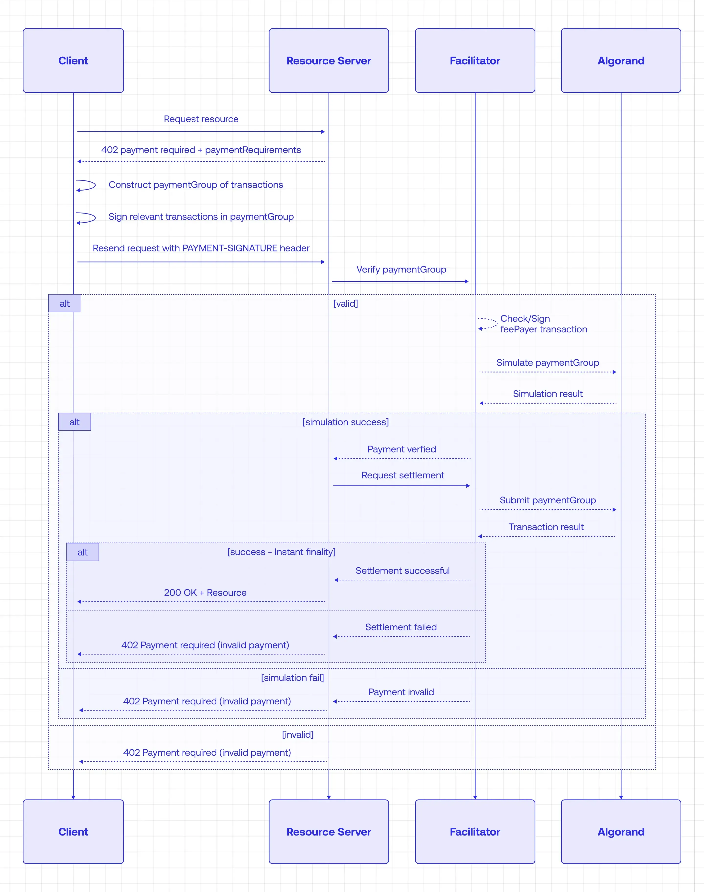

# x402 on Algorand

Learn and implement the **x402 payment protocol** for monetizing APIs on Algorand.

This repository focuses on **API monetization** — one powerful use case of x402. Build protected APIs that charge per request using blockchain-verified payments. No payment processor setup needed.

**x402 version:** 2.11.0  
**Network:** Algorand TestNet

## Getting Started

**New to x402?** Start with **x402-basic-tutorial/** — a step-by-step walkthrough following the [Algorand Developer Portal tutorial](https://dev.algorand.co/resources/x402-on-algorand/). You'll build both client and server code.

**Want to see patterns?** Browse **x402-examples/** — five client implementations (fetch, axios, custom, advanced, MCP) plus reference servers.

**Prerequisites:** Algorand TestNet account with ALGO and USDC.

## Payment Flow

## Learn More

- **[x402 Protocol](https://x402.org/)** — Specification and design
- **[@x402 on npm](https://www.npmjs.com/search?q=%40x402)** — Client and server libraries

The x402 protocol transforms any API into a paid service without changing your code. Payments are transparent, trustless, and verified on-chain.
